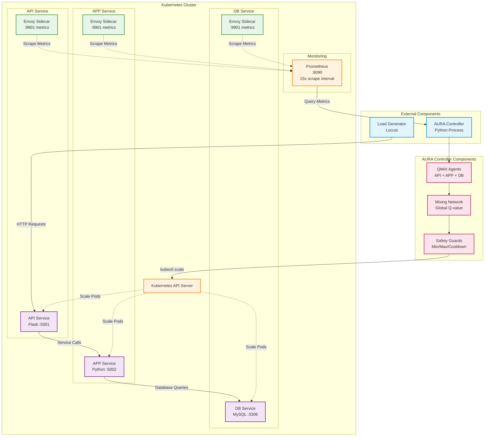

# AURA System Architecture

This diagram illustrates the complete architecture of the AURA (Adaptive Unified Resource Allocator) system, showing how components interact within and outside the Kubernetes cluster.

## Architecture Overview

The system consists of:
- **Kubernetes Cluster**: Hosts the three-tier microservice application with Envoy sidecars
- **Monitoring Stack**: Prometheus for metrics collection and storage
- **AURA Controller**: External Python process with QMIX agents for intelligent scaling decisions
- **Load Generator**: Locust for traffic simulation and testing

## Key Components

### Three-Tier Microservice
- **API Service**: Flask application on port 5001, handles incoming HTTP requests
- **APP Service**: Python application on port 5002, processes business logic
- **DB Service**: MySQL database on port 3306, stores application data

### Envoy Sidecars
- Deployed alongside each service pod
- Expose metrics on port 9901
- Provide detailed observability (queue depth, latency, RPS)

### Prometheus
- Time-series database for metrics storage
- Scrapes Envoy metrics every 15 seconds
- Accessible on port 9090
- Provides query interface for AURA Controller

### AURA Controller
- External Python process with kubectl access
- Makes scaling decisions every 30 seconds
- **QMIX Agents**: Three independent agents (one per service)
  - Each observes 16-dimensional state space
  - Includes: queue depth, RPS derivative, CPU history, latency metrics
- **Mixing Network**: Combines individual Q-values into global decision
- **Safety Guards**: Enforces min/max replicas, cooldown periods, override conditions

### Load Generator
- Locust-based traffic simulation
- Generates realistic workload patterns
- Used for testing and evaluation

## Performance Results
- **55% cost reduction** compared to baseline HPA
- **77% latency improvement** in P99 response times
- Intelligent predictive scaling vs reactive threshold-based scaling